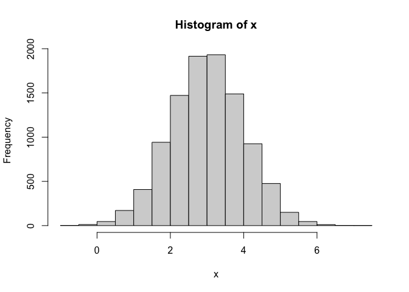
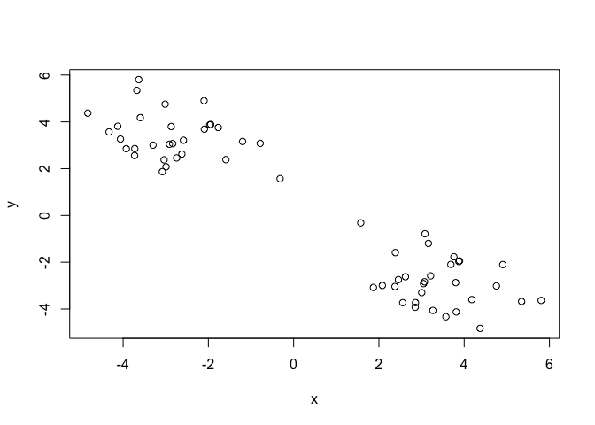
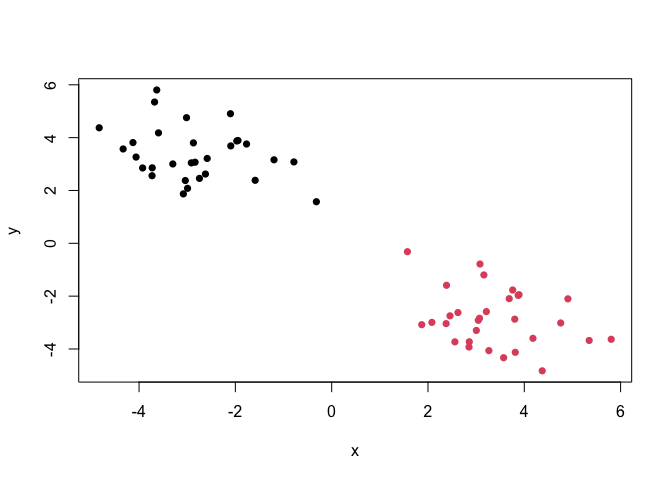
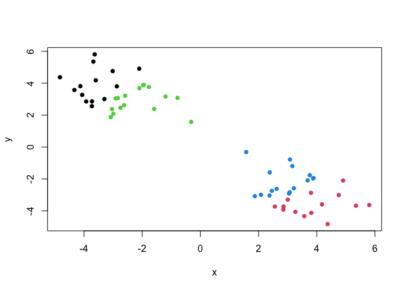
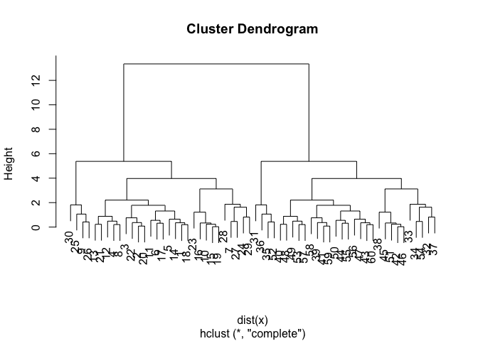
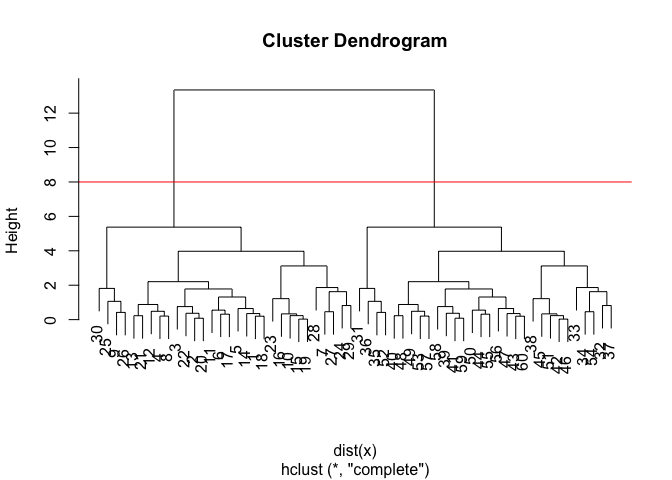
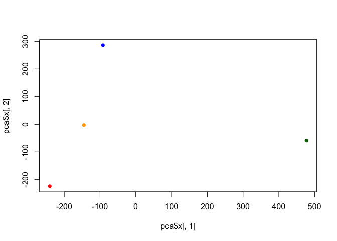
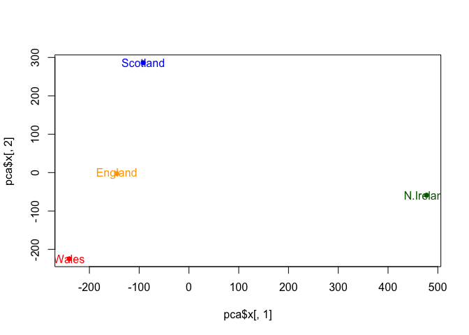

# Class 07: Machine Learning 1
Nashed (PID: A16631132)

\#Clustering

We will start today’s lab with clustering methods, in particular
so-called K-means. The main function for this in R is `kmeans()`.

Let’s try it on some made up data where we know what the answer should
be.

``` r
x <- rnorm(10000,mean=3)
hist(x)
```



We can pass this to the base R plot `plot()` function for a quick.

``` r
tmp <- c(rnorm(30,mean=3), rnorm(30, mean=-3))
x <- cbind(x=tmp, y=rev(tmp))
head(x)
```

                x         y
    [1,] 2.857808 -3.726620
    [2,] 3.045105 -2.914495
    [3,] 3.801583 -2.871451
    [4,] 2.622166 -2.621793
    [5,] 3.004200 -3.299089
    [6,] 3.571196 -4.330514

``` r
plot(x)
```



``` r
k <- kmeans(x, centers=2, nstart= 20)
```

> Q1. How many points are in each cluster?

``` r
k$size
```

    [1] 30 30

> Q2. Cluster membership?

``` r
k$cluster
```

     [1] 2 2 2 2 2 2 2 2 2 2 2 2 2 2 2 2 2 2 2 2 2 2 2 2 2 2 2 2 2 2 1 1 1 1 1 1 1 1
    [39] 1 1 1 1 1 1 1 1 1 1 1 1 1 1 1 1 1 1 1 1 1 1

> Q3. Cluster centers?

``` r
k$centers
```

              x         y
    1 -2.846943  3.374437
    2  3.374437 -2.846943

> Q4. Plot my clustering results

``` r
plot(x, col=k$cluster, pch=16)
```



> Q5. Cluster the data again with kmeans() into 4 groups and plot the
> results.

``` r
k4 <- kmeans(x, centers=4, nstart=20)
plot(x, col=k4$cluster, pch=16)
```



K-means is very popular mostly because it is fast and relatively
straightforward to run and understand. It has a big limitation in that
you need to tell it how many groups (k, or centers) you want.

\#Hierarchical clustering

The main function in base R is called `hclust()`. You have to pass it in
a “distance matrix” not just your input data.

You can generate a distance matrix with the `dist()` function.

``` r
hc <- hclust( dist(x) )
hc
```


    Call:
    hclust(d = dist(x))

    Cluster method   : complete 
    Distance         : euclidean 
    Number of objects: 60 

``` r
plot(hc)
```



to find the clusters (cluster membership vector) from a `hclust()`
result we can “cut” the tree at a certain height that we like.

``` r
plot(hc)
abline(h=8, col="red")
```



``` r
grps <- cutree(hc, h=8)
```

``` r
table(grps)
```

    grps
     1  2 
    30 30 

> Q6. Plot our hclust results.

\#Principal Component Analysis

\##PCA of UK food data

Read data showing the consumption in grams (per person, per week) of 17
different types of food-stuff measured and averaged in the four
countries of the United Kingdom.

Lets see how PCA can help us but first we can try conventional analysis.

``` r
url <- "https://tinyurl.com/UK-foods"
x <- read.csv(url)
x
```

                         X England Wales Scotland N.Ireland
    1               Cheese     105   103      103        66
    2        Carcass_meat      245   227      242       267
    3          Other_meat      685   803      750       586
    4                 Fish     147   160      122        93
    5       Fats_and_oils      193   235      184       209
    6               Sugars     156   175      147       139
    7      Fresh_potatoes      720   874      566      1033
    8           Fresh_Veg      253   265      171       143
    9           Other_Veg      488   570      418       355
    10 Processed_potatoes      198   203      220       187
    11      Processed_Veg      360   365      337       334
    12        Fresh_fruit     1102  1137      957       674
    13            Cereals     1472  1582     1462      1494
    14           Beverages      57    73       53        47
    15        Soft_drinks     1374  1256     1572      1506
    16   Alcoholic_drinks      375   475      458       135
    17      Confectionery       54    64       62        41

``` r
dim(x)
```

    [1] 17  5

> Q1. How many rows and columns are in your new data frame named x? What
> R functions could you use to answer this questions? There are 5
> columns and 17 rows. You can use either dim(x); or ncol(x) and nrow(x)
> to get them independently.

``` r
rownames(x) <- x[,1]
x <- x[,-1]
head(x)
```

                   England Wales Scotland N.Ireland
    Cheese             105   103      103        66
    Carcass_meat       245   227      242       267
    Other_meat         685   803      750       586
    Fish               147   160      122        93
    Fats_and_oils      193   235      184       209
    Sugars             156   175      147       139

``` r
dim(x)
```

    [1] 17  4

``` r
rownames(x) <- x[,1]
x <- x[,-1]
head(x)
```

        Wales Scotland N.Ireland
    105   103      103        66
    245   227      242       267
    685   803      750       586
    147   160      122        93
    193   235      184       209
    156   175      147       139

``` r
url <- "https://tinyurl.com/UK-foods"
x <- read.csv(url, row.names=1)
head(x)
```

                   England Wales Scotland N.Ireland
    Cheese             105   103      103        66
    Carcass_meat       245   227      242       267
    Other_meat         685   803      750       586
    Fish               147   160      122        93
    Fats_and_oils      193   235      184       209
    Sugars             156   175      147       139

> Q2. Which approach to solving the ‘row-names problem’ mentioned above
> do you prefer and why? Is one approach more robust than another under
> certain circumstances? I prefer the second one because if you keep
> running the first one again and again it shifts the data to the left
> and gets rid of valuable information.

``` r
barplot(as.matrix(x), beside=T, col=rainbow(nrow(x)))
```


``` r
barplot(as.matrix(x), beside=FALSE, col=rainbow(nrow(x)))
```


> Q3. Changing what optional argument in the above barplot() function
> results in the following plot? If you change beside(T) to
> beside=FALSE, then the barplot will result in the above plot.

``` r
pairs(x, col=rainbow(17), pch=16) 
```


> Q5: Generating all pairwise plots may help somewhat. Can you make
> sense of the following code and resulting figure? What does it mean if
> a given point lies on the diagonal for a given plot? If the given
> point lies on the diagonal that means that the two countries consume
> the same amount and there are very similair amounts of food consumed
> in both of the countries being compared. Any deviation from the
> diagonal (above or below) means there is more or less being consumed
> compared to the other country.

> Q6. What is the main differences between N. Ireland and the other
> countries of the UK in terms of this data-set? N. Ireland is the
> outlier between all the other countries and it seems like they might
> eat different amounts of fresh potatoes.

\#Principal Component Analysis (PCA)

PCA can help us make sense of these types of datasets. Let’s see how it
works.

The main function in “base” R is called `prcomp()`. In this case we want
to first take the transpose `t()` of our input`x` so the columns are the
food types and the countries are the rows.

``` r
head(t(x))
```

              Cheese Carcass_meat  Other_meat  Fish Fats_and_oils  Sugars
    England      105           245         685  147            193    156
    Wales        103           227         803  160            235    175
    Scotland     103           242         750  122            184    147
    N.Ireland     66           267         586   93            209    139
              Fresh_potatoes  Fresh_Veg  Other_Veg  Processed_potatoes 
    England               720        253        488                 198
    Wales                 874        265        570                 203
    Scotland              566        171        418                 220
    N.Ireland            1033        143        355                 187
              Processed_Veg  Fresh_fruit  Cereals  Beverages Soft_drinks 
    England              360         1102     1472        57         1374
    Wales                365         1137     1582        73         1256
    Scotland             337          957     1462        53         1572
    N.Ireland            334          674     1494        47         1506
              Alcoholic_drinks  Confectionery 
    England                 375             54
    Wales                   475             64
    Scotland                458             62
    N.Ireland               135             41

``` r
pca <-  prcomp(t(x))
summary(pca)
```

    Importance of components:
                                PC1      PC2      PC3       PC4
    Standard deviation     324.1502 212.7478 73.87622 3.176e-14
    Proportion of Variance   0.6744   0.2905  0.03503 0.000e+00
    Cumulative Proportion    0.6744   0.9650  1.00000 1.000e+00

> Q7. Complete the code below to generate a plot of PC1 vs PC2. The
> second line adds text labels over the data points.

``` r
pca$x
```

                     PC1         PC2        PC3           PC4
    England   -144.99315   -2.532999 105.768945 -4.894696e-14
    Wales     -240.52915 -224.646925 -56.475555  5.700024e-13
    Scotland   -91.86934  286.081786 -44.415495 -7.460785e-13
    N.Ireland  477.39164  -58.901862  -4.877895  2.321303e-13

``` r
plot(pca$x[,1], pca$x[,2], 
     col=c("orange", "red", "blue", "darkgreen"),
     pch=16)
```



``` r
plot(pca$x[,1], pca$x[,2], xlab="PC1", ylab="PC2", xlim=c(-270,500))
text(pca$x[,1], pca$x[,2], colnames(x))
```


``` r
plot(pca$x[,1], pca$x[,2], col=c("orange", "red", "blue", "darkgreen" ), pch=16)
text(pca$x[,1], pca$x[,2], colnames(x),col=c("orange", "red", "blue", "darkgreen") )
```



> Q8 Customize your plot so that the colors of the country names match
> the colors in our UK and Ireland map and table at start of this
> document.

``` r
pca$rotation
```

                                 PC1          PC2         PC3          PC4
    Cheese              -0.056955380  0.016012850  0.02394295 -0.694538519
    Carcass_meat         0.047927628  0.013915823  0.06367111  0.489884628
    Other_meat          -0.258916658 -0.015331138 -0.55384854  0.279023718
    Fish                -0.084414983 -0.050754947  0.03906481 -0.008483145
    Fats_and_oils       -0.005193623 -0.095388656 -0.12522257  0.076097502
    Sugars              -0.037620983 -0.043021699 -0.03605745  0.034101334
    Fresh_potatoes       0.401402060 -0.715017078 -0.20668248 -0.090972715
    Fresh_Veg           -0.151849942 -0.144900268  0.21382237 -0.039901917
    Other_Veg           -0.243593729 -0.225450923 -0.05332841  0.016719075
    Processed_potatoes  -0.026886233  0.042850761 -0.07364902  0.030125166
    Processed_Veg       -0.036488269 -0.045451802  0.05289191 -0.013969507
    Fresh_fruit         -0.632640898 -0.177740743  0.40012865  0.184072217
    Cereals             -0.047702858 -0.212599678 -0.35884921  0.191926714
    Beverages           -0.026187756 -0.030560542 -0.04135860  0.004831876
    Soft_drinks          0.232244140  0.555124311 -0.16942648  0.103508492
    Alcoholic_drinks    -0.463968168  0.113536523 -0.49858320 -0.316290619
    Confectionery       -0.029650201  0.005949921 -0.05232164  0.001847469

The “loadings” tell us how much the original variables

``` r
par(mar=c(10, 3, 0.35, 0))
barplot( pca$rotation[,1], las=2 )
```


``` r
par(mar=c(10, 3, 0.35, 0))
barplot( pca$rotation[,2], las=2 )
```


> Q9. Generate a similar ‘loadings plot’ for PC2. What two food groups
> feature prominantely and what does PC2 maninly tell us about? PC2
> mainly tells us about the different food groups between the countries
> and PC2 accounts for any of the variance that was not in PC1. It looks
> like fresh potatoes and soft drinks are different food groups.
